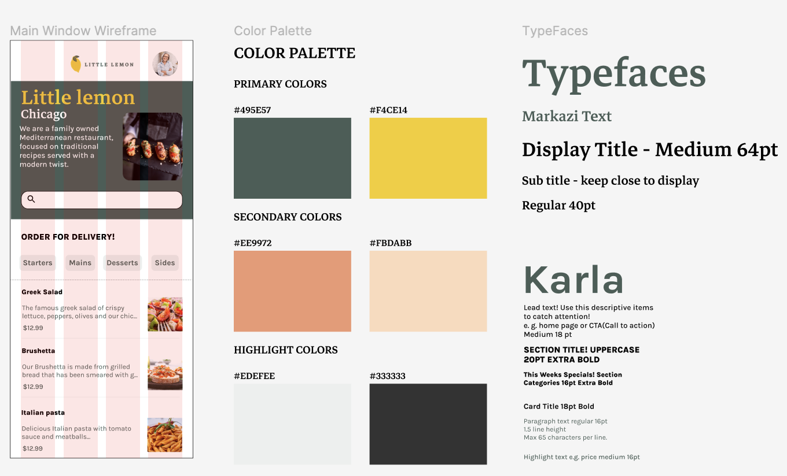
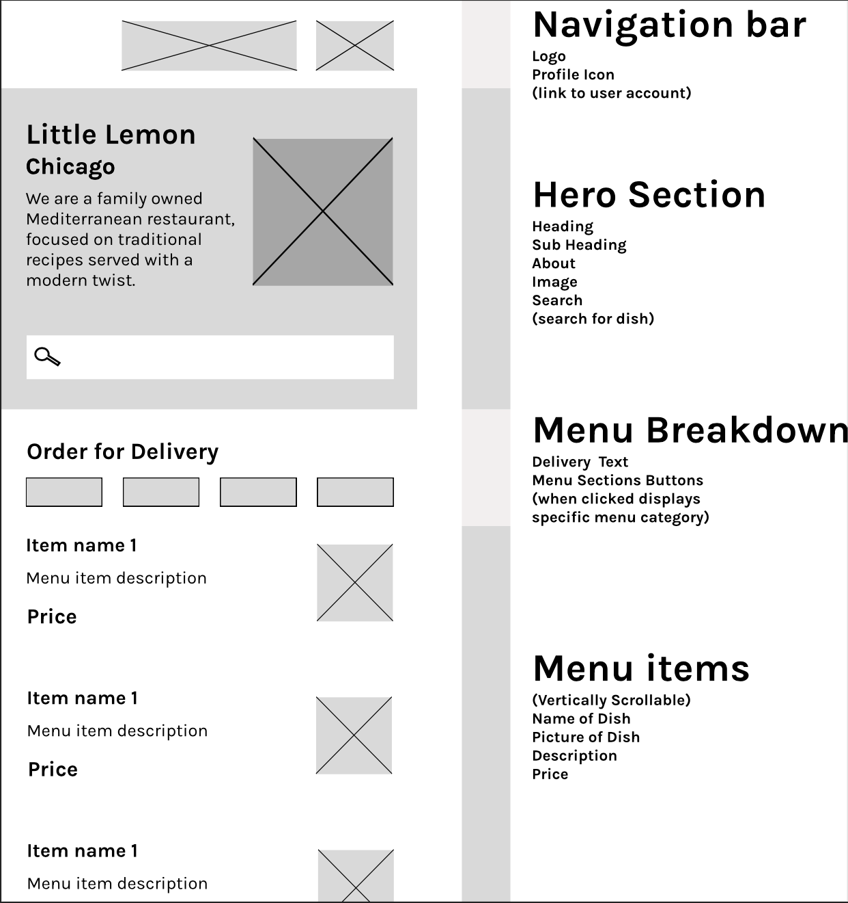

# LittleLemonApp
This is the final project for the Capstone iOS application included in the Meta iOS Developer Professional Certificate program. The app is a food ordering app that allows users to view the Little Lemon Restaurant menu and place orders.

The proposed frame design was used:

<tr>

<td></td>
<td></td>

</tr>
